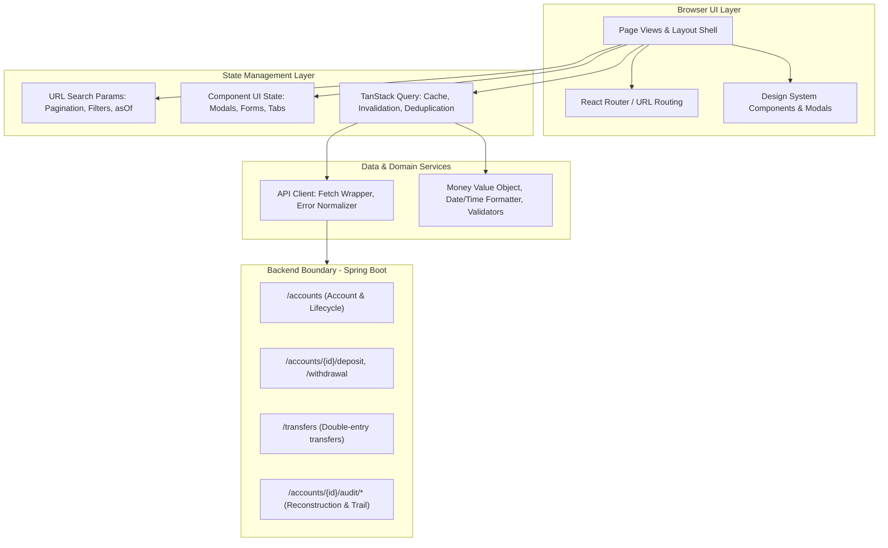
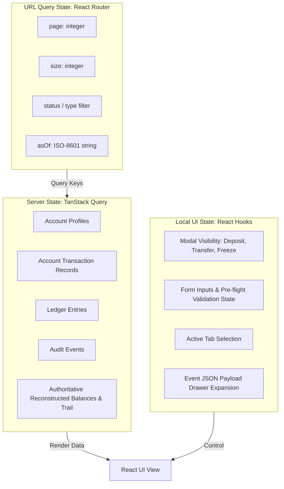
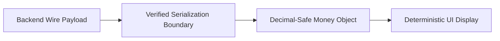
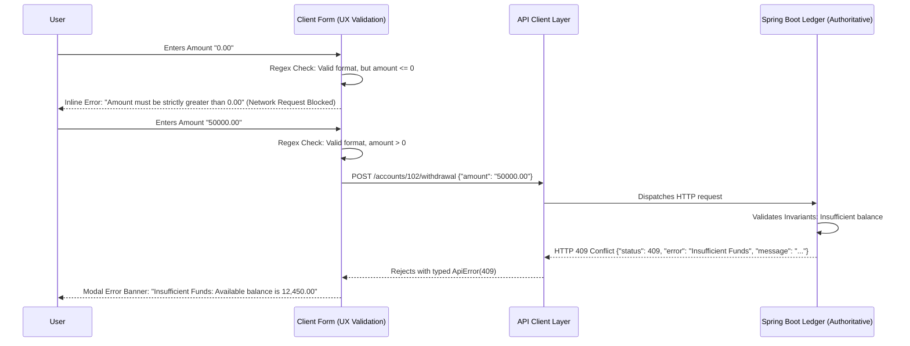
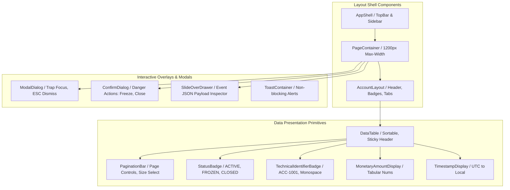
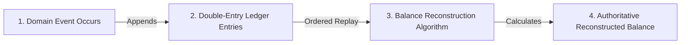
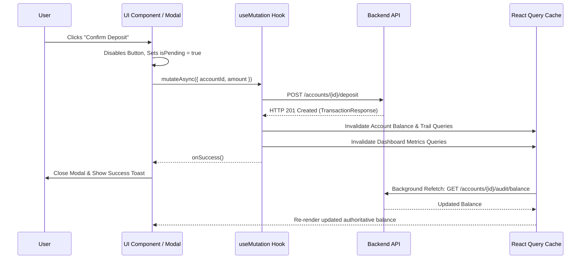
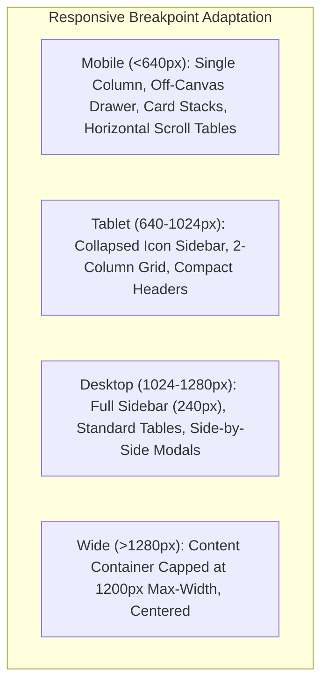

# Frontend Architecture: Event-Sourced Ledger v1.0.0

**Document Version:** 1.0.0  
**Status:** DRAFT — ARCHITECTURE BASELINE (REFINED)  
**Author:** AI Engineering Team  
**Date:** 2026-09-23  
**Target Repository:** `Sushant-813/event-sourced-ledger`  
**Upstream Constraints:**  
- Product Requirements: [`docs/FRONTEND_PRD.md`](file:///d:/PROJECTS/Event%20Sourced%20Ledger/docs/FRONTEND_PRD.md) (Frozen v1.0.0)  
- Technical Requirements: [`docs/FRONTEND_TRD.md`](file:///d:/PROJECTS/Event%20Sourced%20Ledger/docs/FRONTEND_TRD.md) (Baseline Draft)  
- Design & Visual System: [`docs/DESIGN.md`](file:///d:/PROJECTS/Event%20Sourced%20Ledger/docs/DESIGN.md) (Frozen v1.0.0)  
- REST API Guidelines: [`docs/API_GUIDELINES.md`](file:///d:/PROJECTS/Event%20Sourced%20Ledger/docs/API_GUIDELINES.md) (Authoritative)  
- Backend Architecture & ADRs: [`docs/ARCHITECTURE.md`](file:///d:/PROJECTS/Event%20Sourced%20Ledger/docs/ARCHITECTURE.md), [`docs/DECISIONS.md`](file:///d:/PROJECTS/Event%20Sourced%20Ledger/docs/DECISIONS.md)  

---

## Executive Summary & Architectural Scope

This document specifies the technical architecture for the Event-Sourced Ledger frontend application (Frontend v1.0.0). It defines **HOW** the frontend system is structured, layered, and implemented to satisfy the requirements defined in [`FRONTEND_PRD.md`](file:///d:/PROJECTS/Event%20Sourced%20Ledger/docs/FRONTEND_PRD.md) under the technical constraints of [`FRONTEND_TRD.md`](file:///d:/PROJECTS/Event%20Sourced%20Ledger/docs/FRONTEND_TRD.md) and design specifications of [`DESIGN.md`](file:///d:/PROJECTS/Event%20Sourced%20Ledger/docs/DESIGN.md).

### Core Architectural Axioms

1. **Server Authority**: The frontend is strictly a presentation and interaction layer. The backend PostgreSQL ledger and Spring Boot application are the sole sources of truth for financial balances, double-entry invariance, event sequence, transaction lifecycle, and audit integrity.
2. **Zero Client Financial Derivation**: The frontend never calculates running balances, never performs double-entry balancing, never reconstructs historical state independently, and never applies optimistic updates to financial values. All balances displayed are explicitly retrieved from backend queries.
3. **Deterministic Decimal Safety**: JavaScript IEEE 754 binary floating-point arithmetic (`Number`, `parseFloat`) is mathematically prohibited across the monetary data pipeline. All amounts are processed as exact, arbitrary-precision decimal representations.
4. **Appropriate Complexity**: This is a focused management console for a single-service event-sourced ledger, not a multi-tenant micro-frontend or distributed enterprise application. Simple modular boundaries, strong static typing, predictable data flows, and zero unnecessary abstractions take precedence over enterprise framework sprawl.

---

## 1. Application Architecture

### 1.1 High-Level Architecture & Layered Responsibilities

The frontend application follows a unidirectional, four-layer architecture with strict separation of concerns:



### 1.2 Architectural Layers & Boundaries

| Layer | Responsibility | Permitted Dependencies | Forbidden Actions |
| :--- | :--- | :--- | :--- |
| **Presentation / UI** | Render HTML, capture user inputs, trigger mutations, display feedback, manage focus and layout. | Design System CSS tokens, UI primitives, hooks, domain formatters. | Direct `fetch()` calls, raw string manipulation of money, optimistic balance mutations. |
| **Routing & URL State** | Map URL paths to view hierarchies, synchronize search parameters (page, filters, `asOf`) with browser history. | React Router, query parser utilities. | Storing transient UI state (e.g. modal open state) in global routes when unneeded. |
| **Server State / Cache** | Manage asynchronous server data lifecycle (loading, error, success, caching, refetching, invalidation). | TanStack React Query, API client. | Managing local component form inputs or UI modal toggles in React Query. |
| **API Client & Networking** | Serialize HTTP requests, parse responses, handle HTTP error statuses, normalize `ApiError` structures. | Native `fetch`, configuration constants. | Bypassing error normalization; inventing endpoint prefixes (e.g., `/api/v1`). |
| **Domain Utilities** | Arbitrary-precision decimal arithmetic, ISO-8601 UTC timestamp formatting, input regex validation. | Decimal library (e.g., `big.js` / `decimal.js`), native `Intl`. | Utilizing native `Number` for monetary operations; assuming local time in historical queries. |

### 1.3 Server Authority Guarantees

- **No Double-Entry Mechanics**: The frontend does not track debit/credit balance symmetry. It renders ledger entries as returned by `GET /accounts/{accountId}/audit/ledger`.
- **No Optimistic Financial Updates**: When a deposit, withdrawal, or transfer succeeds (HTTP 201), the mutation handler invalidates the account's query cache. The UI displays updated balances only after re-fetching the authoritative balance from `GET /accounts/{id}/audit/balance`.
- **No Balance Synthesis**: Account profile responses (`AccountResponse`) do not include balance fields. The frontend requests balances exclusively through the audit service (`AuditBalanceResponse`) and displays a loading state until returned.

---

## 2. Project & Folder Structure

To ensure discoverability, modularity, and strict adherence to architectural boundaries, the project adopts a **feature-oriented** structure with a shared foundational core. Deep nesting (greater than 4 levels) is prohibited.

```
src/
├── api/                        # HTTP client and shared network definitions
│   ├── client.ts               # Centralized fetch wrapper with error normalization
│   ├── endpoints.ts            # Concrete backend URL generators (no /api/v1 prefix)
│   └── errors.ts               # ApiError class, error codes, and type guards
├── assets/                     # Static assets (favicons, SVGs)
├── components/                 # Shared, domain-agnostic UI primitives (Design System)
│   ├── feedback/               # Alert, Toast, LoadingSpinner, EmptyState, ErrorBoundary
│   ├── layout/                 # AppShell, TopBar, Sidebar, PageContainer, Card
│   ├── navigation/             # NavLink, Breadcrumbs, TabNav
│   ├── overlay/                # ModalDialog, ConfirmDialog, SlideOver
│   ├── table/                  # DataTable, TablePagination, TableHeader
│   └── typography/             # Badges (Status, Technical ID), CodeSnippet
├── features/                   # Domain feature modules (self-contained vertical slices)
│   ├── accounts/               # Account directory, creation, lifecycle (freeze/close)
│   │   ├── api/                # Account queries and mutations
│   │   ├── components/         # AccountList, AccountCard, CreateAccountModal
│   │   ├── pages/              # AccountsPage, AccountDetailPage
│   │   └── types/              # Account DTO interfaces and enums
│   ├── audit/                  # Event stream, ledger entries, balance reconstruction
│   │   ├── api/                # Audit queries (events, ledger, balance, trail)
│   │   ├── components/         # AuditTrailTable, EventPayloadDrawer, AsOfPicker
│   │   ├── pages/              # AuditTrailPage, EventsPage, LedgerPage
│   │   └── types/              # Audit DTO interfaces and enums
│   ├── dashboard/              # Portfolio summary and operational metrics
│   │   ├── api/                # Dashboard account queries (3x GET /accounts)
│   │   ├── components/         # MetricCard, SystemHealthCard, QuickActions
│   │   └── pages/              # DashboardPage
│   └── transactions/           # Monetary operations (Deposit, Withdrawal, Transfer modals/workflows)
│       ├── api/                # Transaction and transfer mutations
│       ├── components/         # DepositModal, WithdrawalModal, TransferModal
│       └── types/              # Transaction and transfer DTO interfaces
├── routes/                     # Application routing definitions and layout shells
│   ├── AppRoutes.tsx           # React Router declarative route tree
│   ├── RootLayout.tsx          # Root shell providing AppShell, Navigation, Toaster
│   └── AccountLayout.tsx       # Account context shell (header, metadata, tabs)
├── styles/                     # Global styles and design system CSS variables
│   ├── tokens.css              # Color tokens, elevation, radii from DESIGN.md §30
│   ├── typography.css          # Inter / JetBrains Mono font declarations
│   ├── reset.css               # Modern CSS reset and accessibility focus defaults
│   └── main.css                # Global root assembly
├── types/                      # Universal cross-domain DTOs and system types
│   ├── common.ts               # PagedResponse<T>, SortDirection, QueryParams
│   └── enums.ts                # Shared enums (AccountStatus, EntryType, etc.)
└── utils/                      # Pure, framework-agnostic utility functions
    ├── date.ts                 # ISO-8601 formatting and UTC asOf normalization
    ├── money.ts                # Arbitrary-precision decimal value object & formatting
    └── validation.ts           # Standard regex patterns and validation helpers
```

### 2.1 File Placement & Responsibility Rules

1. **Features are Independent**: A feature folder (e.g. `features/audit`) contains everything specific to that domain: query hooks, components, pages, and types.
2. **Shared Code Lives in Root Folders**: If a component or utility is used across two or more unrelated features (e.g. `StatusBadge`, `Money` utility, `ApiClient`), it belongs in `components/` or `utils/`.
3. **No Direct Feature-to-Feature Cross Imports**: A component in `features/transactions` must not directly import internal components from `features/audit`. Shared data flows through common types or custom hooks in `features/accounts/api`.
4. **Operations are Workflows, Not Global Pages**: The backend provides no global transaction or transfer listing endpoints. Monetary operations (`Deposit`, `Withdrawal`, `Transfer`) are implemented as modals or workflow overlays launched from the Dashboard (Quick Actions) or Account surfaces, not as separate global routing pages.

---

## 3. Routing Architecture

Routing is implemented via **React Router** using a declarative data router. This ensures first-class support for nested layouts, error boundaries, and URL search parameter synchronization.

### 3.1 Route Hierarchy & Concrete URL Structure

```
/                                   -> DashboardPage (redirects or renders dashboard)
/dashboard                          -> DashboardPage
/accounts                           -> AccountsPage (portfolio directory, filterable)
/accounts/new                       -> CreateAccountPage (or triggers creation modal)
/accounts/:accountId                -> AccountLayout (loads account context)
  ├── overview                      -> AccountOverviewPage (default tab)
  ├── transactions                  -> AccountTransactionsPage (account-scoped history)
  ├── ledger                        -> AccountLedgerPage (account-scoped entries)
  ├── events                        -> AccountEventsPage (account-scoped event stream)
  └── audit                         -> AuditTrailPage (reconstructed balance & trail)
/404                                -> NotFoundPage
*                                   -> Catch-all (renders NotFoundPage)
```

### 3.2 Concrete Route Specifications

| Route Path | View Component | Query Parameters Supported | Parent Layout | Error Boundary |
| :--- | :--- | :--- | :--- | :--- |
| `/dashboard` | `DashboardPage` | None | `RootLayout` | Root Error Page |
| `/accounts` | `AccountsPage` | `page`, `size`, `status`, `accountType`, `sort` | `RootLayout` | Table Error Boundary |
| `/accounts/:accountId` | Redirect to `/accounts/:accountId/overview` | None | `RootLayout` | Account Error Boundary |
| `/accounts/:accountId/overview` | `AccountOverviewPage` | None | `AccountLayout` | Account Error Boundary |
| `/accounts/:accountId/transactions` | `AccountTransactionsPage` | `page`, `size` | `AccountLayout` | Account Error Boundary |
| `/accounts/:accountId/ledger` | `AccountLedgerPage` | `page`, `size`, `entryType`, `sort` | `AccountLayout` | Account Error Boundary |
| `/accounts/:accountId/events` | `AccountEventsPage` | `page`, `size`, `sort` | `AccountLayout` | Account Error Boundary |
| `/accounts/:accountId/audit` | `AuditTrailPage` | `page`, `size`, `asOf` | `AccountLayout` | Account Error Boundary |
| `*` | `NotFoundPage` | None | `RootLayout` | Inline |

### 3.3 Account Identification & Deep-Linking Rules

- **Account IDs are Immutable Longs**: The `:accountId` parameter in URL routes is the backend database primary key (e.g. `/accounts/102`). Account numbers (e.g. `ACC-1001`) are business identifiers displayed in the UI badge, but routing uses `:accountId` to directly align with backend REST paths (`/accounts/{id}`).
- **Deep-Link State Preservation**: All table pagination, active filters, and `asOf` historical query parameters are serialized to the URL search string (e.g., `/accounts/102/audit?page=0&size=20&asOf=2026-09-20T12:00:00Z`). Navigating via deep-link or browser refresh directly hydrates the identical view and historical query state.
- **Account-Not-Found Handling**: If `:accountId` does not exist or refers to `SYS-CASH`, the backend returns HTTP 404. The `AccountLayout` error boundary catches this and renders a dedicated `AccountNotFoundView` with options to return to the Accounts Directory.
- **Transfer Workflow Boundary**: Transfers between accounts are executed via a modal dialog accessible from the Dashboard Quick Actions or Account Overview. The modal captures source, destination, and amount, dispatches `POST /transfers`, and invalidates affected account caches without requiring an isolated top-level route.

---

## 4. State Architecture

State is strictly partitioned into three distinct classifications to prevent state synchronization bugs and eliminate unnecessary global stores:



### 4.1 State Categorization & Technologies

1. **Server State (TanStack React Query)**:
   - Owns all data originating from backend endpoints (`/accounts`, `/transfers`, `/audit/*`).
   - Handles caching, automatic background re-validation on window focus, garbage collection, query deduplication, and mutation lifecycle.
   - Cache keys are strictly namespaced and deterministic:
     - `['accounts', 'list', { page, size, status, accountType, sort }]`
     - `['accounts', accountId]`
     - `['accounts', accountId, 'balance', { asOf }]`
     - `['accounts', accountId, 'audit-trail', { page, size, asOf }]`
     - `['accounts', accountId, 'events', { page, size, sort }]`
     - `['accounts', accountId, 'ledger', { page, size, entryType, sort }]`
     - `['accounts', accountId, 'transactions', { page, size }]`
2. **URL Search Parameter State (`useSearchParams`)**:
   - Owns query parameters that affect data presentation: pagination (`page`, `size`), filters (`status`, `accountType`, `entryType`), sorting (`sort`), and historical temporal bounds (`asOf`).
   - Ensures back/forward browser navigation works correctly and views are bookmarkable.
3. **Local Component & Form State (`useState`, `useReducer`, controlled inputs)**:
   - Owns purely transient, ephemeral UI concerns:
     - Modal visibility (`isDepositModalOpen`, `isTransferModalOpen`, `isFreezeConfirmOpen`).
     - Form draft inputs prior to submission.
     - Collapsed/expanded state of JSON payload inspection drawers.
     - Toast notifications stack.
4. **Rejection of Global Stores (Zustand / Redux)**:
   - A global store like Redux or Zustand is **explicitly rejected**.
   - **Rationale**: 100% of the domain data in this ledger application is server-authoritative state. Managing server data in Redux causes cache desynchronization, duplicate loading logic, and boilerplate actions. UI state in this application is local to specific layouts or components and does not require global cross-slice pub/sub.

---

## 5. API Architecture & HTTP Client

### 5.1 Base Configuration & Absolute Path Integrity

The frontend communicates with the backend REST service over HTTP/HTTPS.

- **Base URL Configuration**: Read from the environment variable `VITE_API_BASE_URL` (defaulting to empty string for relative proxying in development or a configured backend URL).
- **Path Structure**: **NO `/api/v1` PREFIX**. The backend Spring Boot controllers explicitly mount root resources:
  - Account Controller: `@RequestMapping("/accounts")`
  - Transfer Controller: `@RequestMapping("/transfers")`
  - Audit Controller: `@RequestMapping("/accounts/{accountId}/audit")`
- The API client strictly constructs paths against these verified backend routes.

### 5.2 API Endpoint Registry

```typescript
// src/api/endpoints.ts
export const ENDPOINTS = {
  accounts: {
    base: () => `/accounts`,
    byId: (id: number | string) => `/accounts/${id}`,
    byNumber: (accountNumber: string) => `/accounts/by-number/${accountNumber}`,
    freeze: (id: number | string) => `/accounts/${id}/freeze`,
    activate: (id: number | string) => `/accounts/${id}/activate`,
    close: (id: number | string) => `/accounts/${id}/close`,
    deposit: (id: number | string) => `/accounts/${id}/deposit`,
    withdrawal: (id: number | string) => `/accounts/${id}/withdrawal`,
  },
  transfers: {
    base: () => `/transfers`,
  },
  audit: {
    events: (accountId: number | string) => `/accounts/${accountId}/audit/events`,
    transactions: (accountId: number | string) => `/accounts/${accountId}/audit/transactions`,
    ledger: (accountId: number | string) => `/accounts/${accountId}/audit/ledger`,
    balance: (accountId: number | string) => `/accounts/${accountId}/audit/balance`,
    trail: (accountId: number | string) => `/accounts/${accountId}/audit/trail`,
  },
} as const;
```

### 5.3 Typed DTO Contracts

All DTOs directly mirror the backend Java records and Spring Boot validation specifications. **No fields absent from the backend are introduced** (in particular, `AccountResponse` contains no balance, and `AccountTransactionResponse` contains no amount):

```typescript
// src/types/common.ts
export interface PagedResponse<T> {
  content: T[];
  page: number;
  size: number;
  totalPages: number;
  totalElements: number;
}

// src/features/accounts/types/account.ts
export type AccountType = 'SAVINGS' | 'CURRENT';
export type AccountStatus = 'ACTIVE' | 'FROZEN' | 'CLOSED';

export interface AccountResponse {
  id: number;
  accountNumber: string;
  accountName: string;
  accountType: AccountType;
  status: AccountStatus;
  createdAt: string; // ISO-8601 UTC
  updatedAt: string; // ISO-8601 UTC
}

export interface CreateAccountRequest {
  accountNumber: string;
  accountName: string;
  accountType: AccountType;
}

// src/features/transactions/types/transaction.ts
export type TransactionType = 'DEPOSIT' | 'WITHDRAWAL' | 'TRANSFER';
export type TransactionStatus = 'COMPLETED' | 'PENDING' | 'FAILED';

export interface DepositRequest {
  amount: string; // Validated decimal string matching ^\d+(\.\d{1,2})?$
}

export interface WithdrawalRequest {
  amount: string;
}

export interface TransferRequest {
  sourceAccountId: number;
  destinationAccountId: number;
  amount: string;
}

export interface TransactionResponse {
  transactionId: number;
  referenceNumber: string;
  transactionType: TransactionType;
  status: TransactionStatus;
  accountId: number;
  amount: string | number; // Wire format boundary safe
  createdAt: string;
}

export interface TransferResponse {
  transactionId: number;
  referenceNumber: string;
  transactionType: TransactionType;
  status: TransactionStatus;
  sourceAccountId: number;
  destinationAccountId: number;
  amount: string | number;
  createdAt: string;
}

// src/features/audit/types/audit.ts
export type EntryType = 'DEBIT' | 'CREDIT';
export type EventType = 'ACCOUNT_CREATED' | 'DEPOSIT' | 'WITHDRAWAL' | 'TRANSFER_DEBIT' | 'TRANSFER_CREDIT';

export interface AccountLedgerEntryResponse {
  ledgerEntryId: number;
  transactionId: number;
  referenceNumber: string;
  entryType: EntryType;
  amount: string | number;
  createdAt: string;
}

export interface AccountEventResponse {
  eventId: number;
  eventType: EventType;
  transactionId: number | null;
  payload: string | null; // Raw JSON string
  occurredAt: string;
}

export interface AccountTransactionResponse {
  transactionId: number;
  referenceNumber: string;
  transactionType: TransactionType;
  status: TransactionStatus;
  createdAt: string;
  // NOTE: amount is intentionally absent in AccountTransactionResponse per backend DTO design
}

export interface AuditBalanceResponse {
  accountId: number;
  balance: string | number;
  asOf: string | null;
}

export interface AuditTrailItemResponse {
  eventId: number;
  eventType: EventType;
  transactionId: number | null;
  referenceNumber: string | null;
  balanceChange: string | number;
  runningBalance: string | number;
  occurredAt: string;
}

export interface AuditTrailResponse {
  accountId: number;
  finalBalance: string | number;
  asOf: string | null;
  items: AuditTrailItemResponse[];
  page: number;
  size: number;
  totalPages: number;
  totalElements: number;
}
```

### 5.4 Centralized Fetch Client & Error Normalization Contract

The API client layer wraps native browser `fetch` to normalize all responses and transport errors into a typed error structure:

```typescript
// Architectural Contract: Error Model
export interface BackendErrorBody {
  timestamp?: string;
  status: number;
  error: string;
  message: string;
  path?: string;
}

export class ApiError extends Error {
  constructor(
    public readonly status: number,
    public readonly errorTitle: string,
    public readonly serverMessage: string,
    public readonly path?: string,
    public readonly isNetworkError: boolean = false
  ) {
    super(`[HTTP ${status}] ${errorTitle}: ${serverMessage}`);
    this.name = 'ApiError';
  }
}

// Architectural Contract: Client Function Signature
export interface RequestOptions extends RequestInit {
  params?: Record<string, string | number | boolean | undefined | null>;
}

export declare function apiClient<T>(endpoint: string, options?: RequestOptions): Promise<T>;
```

**Client Responsibilities**:
1. Appends query parameters cleanly, skipping undefined/null entries.
2. Sets default `Accept: application/json` and `Content-Type: application/json` headers when request bodies are present.
3. Parses non-2xx HTTP responses into `ApiError` using the backend error schema (`timestamp`, `status`, `error`, `message`, `path`).
4. Catches network failures (DNS, CORS, offline) and maps them to `ApiError` with `status: 0` and `isNetworkError: true`.

---

## 6. Monetary Architecture — CRITICAL

### 6.1 The Mathematical Hazard & IEEE 754 Prohibition

In JavaScript, standard `Number` values are double-precision 64-bit IEEE 754 binary floating-point numbers. They cannot accurately represent most base-10 decimal fractions:
```javascript
// Demonstration of floating-point inaccuracies:
0.1 + 0.2 === 0.30000000000000004
10000000000000.01 + 0.02 === 10000000000000.029
```
In an event-sourced financial ledger, floating-point rounding errors will corrupt balance displays, produce incorrect debit/credit indicators, and destroy audit credibility.

**Architectural Rules**:
1. `Number(x)` and `parseFloat(x)` are **strictly prohibited** for performing monetary arithmetic.
2. Binary floating-point arithmetic operators (`+`, `-`, `*`, `/`) are **strictly prohibited** on monetary fields.
3. Every monetary value is encapsulated in a dedicated, arbitrary-precision decimal value object: `Money`.

### 6.2 The Unresolved Backend Wire-Format Boundary

[`FRONTEND_TRD.md`](file:///d:/PROJECTS/Event%20Sourced%20Ledger/docs/FRONTEND_TRD.md) §17 explicitly documented an open wire-format question:
- `API_GUIDELINES.md` §17 and all JSON documentation examples represent monetary fields as **JSON strings** (e.g. `"amount": "100.00"`).
- The backend Java source code contains `BigDecimal` fields in records (e.g., `AuditBalanceResponse`) with **no custom Jackson serializer** and no `WRITE_BIGDECIMAL_AS_PLAIN` setting in `application.properties`. Under default Jackson serialization, `BigDecimal` may be emitted over the wire as an unquoted **JSON number** (e.g. `{"balance": 100.00}`).



**Architecture Boundary & Requirements**:
1. **The Wire-Format Decision Remains Open**: The frontend architecture does not silently declare this issue resolved, nor does it invent a new backend contract.
2. **Response Ingestion**:
   - If the backend emits JSON strings, the string is ingested directly into the arbitrary-precision decimal abstraction without touching native floating-point math.
   - If the backend emits JSON numbers, the architecture acknowledges that standard browser `JSON.parse` will parse unquoted numbers into IEEE 754 double floats *before* application code executes. For sufficiently large values, precision loss occurs at the browser parsing boundary.
   - **Verification Requirement**: The architecture requires live API smoke verification against the running backend instance to confirm whether Jackson emits strings or numbers before finalizing parser optimizations.
3. **Request Serialization**:
   - Request serialization must strictly adhere to the verified backend contract. The frontend does not unilaterally alter payload formats.

### 6.3 Monetary Value Object Contract (`Money`)

The frontend encapsulates monetary domain operations behind an arbitrary-precision decimal abstraction (backed by a proven decimal library such as `big.js` or `decimal.js`):

```typescript
// Architectural Contract: Money Value Object Interface
export interface MoneyValueObject {
  isZero(): boolean;
  isPositive(): boolean;
  isNegative(): boolean;
  gte(other: MoneyValueObject): boolean;
  gt(other: MoneyValueObject): boolean;
  toWireString(): string; // Exactly 2 decimal places: "100.00"
  format(options?: { showPositiveSign?: boolean; showNegativeParentheses?: boolean }): string;
}

export declare class Money implements MoneyValueObject {
  static fromWire(value: string | number | null | undefined): Money;
  static fromInput(input: string): Money;
  static zero(): Money;
  // Implementation guarantees arbitrary-precision arithmetic and exact 2-decimal formatting
}
```

### 6.4 Monetary Presentation Architecture (`MonetaryAmountDisplay`)

- **Currency Neutrality**: Frontend v1.0.0 is currency-neutral and does not establish an unverified default currency (e.g. `USD`). Monetary values are displayed as formatted numbers with tabular figure alignment.
- **Tabular Figures**: All monetary displays use the CSS property `font-variant-numeric: tabular-nums` to ensure exact column alignment in tables.
- **Visual Distinction**: Positive deltas, negative deltas, and zero balances use distinct styling (green for credits/positive, red/parentheses for debits/negative, neutral for zero), combined with explicit textual or sign indicators for accessibility.

---

## 7. Date & Time Architecture

### 7.1 ISO-8601 UTC Wire Format & Presentation

- **Backend Wire Format**: The backend emits and accepts timestamps strictly in ISO-8601 format with explicit UTC offsets (`OffsetDateTime`, e.g. `2026-09-20T14:30:00Z` or `2026-09-20T20:00:00+05:30`).
- **Client Presentation**: Timestamps are parsed as UTC instants and presented in the user's local browser timezone with seconds resolution, accompanied by an explicit timezone descriptor:
  - Format: `YYYY-MM-DD HH:mm:ss [TZ]` (e.g. `2026-09-20 19:30:00 EST`).
  - Native `Intl.DateTimeFormat` is utilized exclusively to avoid heavy date library bundle overhead.

### 7.2 The `asOf` Historical Query Parameter & Inclusive Semantics

- **Strict Inclusive Semantics**: The backend applies an inclusive boundary for historical balance and audit trail queries:
  $$\text{occurredAt} \le \text{asOf}$$
- **Zero Event-ID Truncation**: The frontend accepts temporal boundaries only at timestamp resolution. It never passes event IDs or attempts to filter events post-fetch.
- **Normalization to UTC**: User input from datetime picker controls (which select local date and time) is normalized to a fully qualified ISO-8601 UTC string (`toISOString()`) prior to network transmission.
- **Temporal Stability**: Navigating pages in an historical audit trail retains the exact `asOf` query string, guaranteeing identical historical reconstruction across all pages.

---

## 8. Validation Architecture

Validation is layered across the application. Frontend client-side validation serves exclusively as **User Experience (UX) Guidance** to catch formatting mistakes before dispatching requests. The backend remains the **Sole Authority** for domain integrity and invariant enforcement.



### 8.1 Validation Responsibility Matrix

| Operation | Client-Side Pre-Flight Check (UX) | Backend Authoritative Validation (Enforced) |
| :--- | :--- | :--- |
| **Account Creation** | `accountNumber`: required, regex `^[A-Za-z0-9-_]{3,30}$`<br>`accountName`: required, 1–100 chars<br>`accountType`: `SAVINGS` or `CURRENT` | Uniqueness of `accountNumber`, database constraints, audit event emission. |
| **Deposit** | `amount`: regex `^\d+(\.\d{1,2})?$`, amount > 0.00, integer digits <= 17 | `@DecimalMin("0.01")`, `@Digits(integer=17, fraction=2)`, Account status == `ACTIVE`. |
| **Withdrawal** | `amount`: regex `^\d+(\.\d{1,2})?$`, amount > 0.00, integer digits <= 17 | Account status == `ACTIVE`, sufficient balance verification against ledger entries. |
| **Transfer** | Source != Destination ID,<br>`amount` regex `^\d+(\.\d{1,2})?$`, amount > 0.00 | Source != Dest, both accounts exist & `ACTIVE`, source has sufficient balance. |
| **Lifecycle** | Confirmation dialog acceptance | Valid status transition (`ACTIVE` -> `FROZEN` -> `ACTIVE`, `*` -> `CLOSED`), non-zero balance on close. |
| **Pagination** | `page >= 0`, `1 <= size <= 100` | `@Min(0)` for page, `@Min(1) @Max(100)` for size. |
| **Historical `asOf`** | Valid ISO-8601 date string, not in the future | Valid `OffsetDateTime` parsing, temporal query filtering. |

### 8.2 Client-Side Validation Rules

1. **No Duplicate Insufficient-Funds Calculation**: The frontend never compares a withdrawal amount against the locally cached balance to block submission. Account balances may change concurrently. The backend must evaluate the balance at the instant of transaction processing.
2. **Deterministic Error Messages**: Field-level validation messages appear directly beneath input fields on blur or form submission, linked via `aria-describedby` for screen reader accessibility.

---

## 9. Error Architecture

### 9.1 End-to-End Error Flow

Every error in the system flows through a standardized 3-stage handling pipeline:

```
[Raw HTTP Failure / Network Error / Backend Rejection]
                           ↓
             [API Client Error Normalizer]
      Maps HTTP status & body to typed `ApiError`
                           ↓
    [Feature Query / Mutation Hook (React Query)]
      Categorizes severity: Form-level vs Page-level
                           ↓
                  [User-Facing UI]
    - 400/409/422: Inline field errors or Modal alert banners
    - 404: Dedicated NotFound views or table empty states
    - 500/Network: Global toast notification or Error Boundary
```

### 9.2 HTTP Status Mapping & UX Behavior

| Status Code | Server Condition | Frontend UX Handling |
| :--- | :--- | :--- |
| **400 Bad Request** | Malformed parameters, invalid ID format, invalid `asOf` timestamp. | Displays alert banner inside the active modal or table header with `ApiError.serverMessage`. |
| **404 Not Found** | Account ID does not exist, or requested route targets `SYS-CASH`. | Trigger `AccountNotFoundView` in `AccountLayout`, or generic 404 page for route failures. |
| **409 Conflict** | Insufficient funds, account frozen/closed, duplicate account number. | Keeps form open, re-enables submit button, highlights relevant field with backend explanation. |
| **422 Unprocessable** | Request body syntactically valid but failed Spring `@Valid` annotations. | Maps field-specific constraint errors directly to input labels. |
| **500 Server Error** | Unexpected unhandled backend exception or database failure. | Displays prominent error banner: "Server error occurred. The ledger state was not altered." Never leaks stack traces. |
| **Network Failure** | CORS error, connection refused, DNS failure, server offline (`status: 0`). | Persistent toast: "Unable to connect to ledger server. Please verify backend is running." Retries muted for mutations. |

---

## 10. Component Architecture

The component hierarchy is structured strictly according to the Design System outlined in [`DESIGN.md`](file:///d:/PROJECTS/Event%20Sourced%20Ledger/docs/DESIGN.md). No third-party UI component libraries (e.g. MUI, Ant Design) are used; components are written in clean semantic HTML with CSS custom properties.



### 10.1 Shared Component Responsibilities

1. **`AppShell` (`components/layout/AppShell.tsx`)**:
   - Manages top-level application navigation, responsive sidebar drawer toggle for mobile screens (<1024px), top status bar, and accessibility skip links (`#main-content`).
2. **`AccountLayout` (`routes/AccountLayout.tsx`)**:
   - Renders account metadata banner: Account Name, Technical Account Number (`TechnicalIdentifierBadge`), Status (`StatusBadge`), Account Type, and active balance (retrieved from the authoritative balance endpoint).
   - Hosts horizontal sub-navigation tabs (`Overview`, `Transactions`, `Ledger`, `Events`, `Audit Trail`).
3. **`DataTable<T>` (`components/table/DataTable.tsx`)**:
   - Renders tabular data with accessible ARIA semantics (`role="table"`, `<th scope="col">`).
   - Supports sticky headers, column-level alignment (right-aligned for monetary figures, monospace for identifiers), empty state rendering, and loading skeleton overlays.
4. **`ModalDialog` (`components/overlay/ModalDialog.tsx`)**:
   - Implements strict accessibility standards: traps focus, handles `Escape` key dismissal, disables body scroll, and restores focus to triggering element upon close.
5. **`StatusBadge` (`components/typography/StatusBadge.tsx`)**:
   - Renders account status (`ACTIVE`, `FROZEN`, `CLOSED`) or transaction status with dual visual encoding (color and distinctive text/icon) to ensure accessibility for color-blind users.

---

## 11. Account-Centric Architecture

### 11.1 Domain Boundary & Navigation Context

In the Event-Sourced Ledger, the **Account** is the primary aggregate root. The UI architecture organizes sub-views around the account context:

```
/accounts/:accountId/
  ├── overview      -> Core identity, current balance, lifecycle actions
  ├── transactions  -> High-level business transaction history (account-scoped)
  ├── ledger        -> Double-entry debit/credit ledger entries (account-scoped)
  ├── events        -> Immutable event stream with JSON payload inspection (account-scoped)
  └── audit         -> Step-by-step reconstructed balance audit trail
```

### 11.2 Account Metadata & Authoritative Balance Loading

- **No Balance in Account Metadata**: `AccountResponse` does not include balance.
- **AccountLayout Balance Loading**: The balance displayed in the `AccountLayout` header banner is fetched via a separate authoritative query to `GET /accounts/{id}/audit/balance`.
- **No N+1 Balance Fetching in Directory**: The Accounts Directory (`/accounts`) renders account profiles using `AccountResponse` exclusively (account number, name, type, status, creation date). The frontend **does not** execute an N+1 cascade of balance queries for the account list.
- **Query Sharing**: The account profile (`['accounts', accountId]`) and balance (`['accounts', accountId, 'balance']`) are cached by TanStack Query, allowing sub-tabs to read cached metadata without refetching.

### 11.3 System Account (`SYS-CASH`) Isolation

- **Authoritative Backend Isolation**: The backend maintains internal account `SYS-CASH` (ID 1) and returns HTTP 404 for any direct access (`/accounts/1`, `/accounts/by-number/SYS-CASH`).
- **Frontend Reaction**:
  - The frontend never presents `SYS-CASH` in account selection dropdowns (e.g., transfer destination picker).
  - If a user navigates to `/accounts/1`, the frontend catches the resulting HTTP 404 response from the backend and renders `AccountNotFoundView`.
  - The frontend does not attempt to independently duplicate complex backend isolation rules; it respects the backend's authoritative 404 boundary.

---

## 12. Audit Trail Architecture

The **Audit Trail** is the signature differentiator of the event-sourced system. It provides provable traceability from immutable domain events to ledger debit/credit entries and reconstructed balances.



### 12.1 Authoritative Backend Reconstruction Consumption

- **Zero Client Algorithm Replication**: The frontend does not calculate running balances or sum debit/credit lines.
- **Data Source**: The audit trail view calls `GET /accounts/{accountId}/audit/trail?page=0&size=20[&asOf=...]`.
- **Specialized DTO Consumption**: Unlike generic lists, the audit endpoint returns an `AuditTrailResponse`:
  - `finalBalance`: The authoritative reconstructed balance at the query boundary (stable across all pages).
  - `items`: Ordered audit items containing `balanceChange`, `runningBalance`, `occurredAt`, `eventType`, and `referenceNumber`.
  - `asOf`: The applied temporal cutoff point (if specified).

### 12.2 Pagination & Temporal Consistency

1. **Page-Independent Final Balance**: When viewing subsequent pages of an audit trail, `finalBalance` remains the authoritative balance as of the query boundary. The frontend displays this prominent figure in the audit header while paginating through granular historical steps.
2. **Stable Sort Order**: Audit trails are strictly sorted by the backend in canonical event sequence. Client-side re-sorting of audit trail tables is disabled.
3. **Empty Historical States**: If an `asOf` cutoff precedes account creation, the backend returns an empty `items` array and `finalBalance: 0.00`. The frontend renders a dedicated empty state: *"No ledger events occurred prior to the selected historical timestamp."*

---

## 13. Dashboard Architecture

### 13.1 Supported Metrics

Per [`FRONTEND_PRD.md`](file:///d:/PROJECTS/Event%20Sourced%20Ledger/docs/FRONTEND_PRD.md) §4 and [`DESIGN.md`](file:///d:/PROJECTS/Event%20Sourced%20Ledger/docs/DESIGN.md) §22, the Dashboard supports **exactly three metrics**:
- **Total Accounts**
- **Active Accounts**
- **Frozen Accounts**

*No derived `closedAccounts` metric or unverified global metrics are introduced.*

### 13.2 Metric Aggregation Strategy

Because the backend v1.0.0 API does not expose a global `/stats` endpoint, the frontend obtains these metrics by executing **three concurrent queries** against `GET /accounts`:
1. `GET /accounts?page=0&size=1` -> reads `totalElements` for Total Accounts.
2. `GET /accounts?status=ACTIVE&page=0&size=1` -> reads `totalElements` for Active Accounts.
3. `GET /accounts?status=FROZEN&page=0&size=1` -> reads `totalElements` for Frozen Accounts.

```typescript
// Architectural Contract: Dashboard Metrics Aggregation
export interface DashboardMetrics {
  totalAccounts: number;
  activeAccounts: number;
  frozenAccounts: number;
}

// Aggregation logic dispatches the 3 requests concurrently via Promise.all
// and returns the extracted totalElements counts.
```

---

## 14. Mutation Architecture

### 14.1 Mutation Lifecycle & Cache Invalidation

All write operations (account creation, deposits, withdrawals, transfers, and lifecycle status changes) are managed through TanStack Query `useMutation` hooks.



### 14.2 Strict Prohibition of Optimistic Updates

- **Zero Speculative Accounting**: The frontend **never** applies optimistic updates to account balances or ledger tables upon mutation dispatch.
- **Rationale**: Financial balances depend on database locks, sequence numbers, and strict transaction isolation. If a deposit or transfer fails on the server, an optimistic update creates an invalid financial state in the UI. Authoritative balance updates occur exclusively after backend re-fetch.

### 14.3 Duplicate Submission Prevention

1. **Button Disabling**: Action buttons enter a disabled `isPending` state immediately upon click, displaying an accessible loading spinner.
2. **Keyboard Lock**: Form submission via the `Enter` key is disabled while a mutation is inflight.
3. **Idempotency Readiness**: While v1.0.0 backend endpoints do not require an `Idempotency-Key` header, the mutation wrapper is structured to easily attach unique client UUIDs when supported by future backend versions.

---

## 15. Pagination, Filter & Sort Architecture

### 15.1 URL-Synchronized State Model

To support browser history, refresh survival, and deep-linking, pagination, sorting, and filtering state are synchronized with URL search parameters (e.g., `?page=1&size=20&status=ACTIVE&sort=accountName,asc`).

### 15.2 Server Capability Enforcement & Parameter Allowlisting

The frontend strictly enforces backend parameter constraints to prevent HTTP 400 rejections:
- **Page Bounds**: `page >= 0`, `1 <= size <= 100` (Default: `page=0`, `size=20`).
- **Out-of-Range Handling**: If a user navigates to an out-of-range page (e.g. `page=999`), the backend returns HTTP 200 with an empty `content: []` array. The UI renders: *"No records found on this page."* with a button to return to page 1.
- **Strict Parameter Allowlisting**:
  - `GET /accounts`: Filters: `status`, `accountType`. Sorts: `createdAt`, `accountName`, `accountNumber`.
  - `GET /audit/ledger`: Filters: `entryType` (`CREDIT` or `DEBIT`). Sorts: `createdAt`.
  - `GET /audit/events`: Sorts: `occurredAt`.
  - `GET /audit/trail`: No client filters or sorts permitted (canonical ordering).

---

## 16. Accessibility Architecture (WCAG 2.1 AA)

The application adheres to WCAG 2.1 Level AA accessibility standards across all components and views:

### 16.1 Semantic HTML & Structural Landmarks

- Proper landmark tags: `<header>`, `<nav>`, `<main id="main-content">`, `<aside>`, and `<footer>`.
- Every page has a unique, descriptive `<h1>` title corresponding to its domain context.
- Skip Navigation: A top-level skip link (`Skip to main content`) allows keyboard users to bypass sidebar navigation.

### 16.2 Keyboard Navigation & Focus Management

- **Modal Dialog Focus Trapping**: Opening a modal traps keyboard focus within the dialog container. Pressing `Escape` closes the modal and returns focus to the initiating trigger button.
- **Route Change Focus**: On route navigation, keyboard focus is programmatically shifted to the main content container (`<main tabindex="-1">`) so screen readers announce the new view.

### 16.3 Screen Reader Feedback & Color Independence

- **`aria-live` Regions**: A polite live region (`aria-live="polite"`) announces asynchronous events (toast notifications, successful deposits, balance updates).
- **Dual Visual Encoding**: Statuses are never conveyed solely through color. The `StatusBadge` component includes explicit text and unique geometric indicator dots (e.g. green circle for `ACTIVE`, amber pause bar for `FROZEN`, gray slash for `CLOSED`).
- **Contrast Ratios**: All text and interactive controls maintain a contrast ratio >= 4.5:1 against their backgrounds (meeting WCAG AA).

---

## 17. Responsive Architecture

The application layout adapts fluidly across the 4 standard breakpoints defined in [`DESIGN.md`](file:///d:/PROJECTS/Event%20Sourced%20Ledger/docs/DESIGN.md) §26:

```
Mobile (<640px) | Tablet (640–1024px) | Desktop (1024–1280px) | Wide (>1280px)
```



### 17.1 Responsive Adaptation Strategies

1. **Application Shell**:
   - Desktop (>=1024px): Persistent 240px left sidebar with fixed top bar.
   - Mobile/Tablet (<1024px): Sidebar collapses into an off-canvas slide-out drawer triggered by a top-bar hamburger button.
2. **Data Tables**:
   - Tables feature `overflow-x: auto` wrappers with smooth touch scrolling and sticky left identifier columns to preserve context on narrow screens.
3. **Max-Width Centering**:
   - On wide monitors (>1280px), main content is constrained to a `max-width: 1200px` container with automatic horizontal margins to prevent excessive eye travel.

---

## 18. Security Architecture

### 18.1 Client-Side Threat Model & Boundaries

Frontend v1.0.0 operates in an internal enterprise environment with **no user authentication, no login screens, and no client-side RBAC**. The architecture establishes rigorous safeguards against common web vulnerabilities:

1. **No Client Authorization Claims**: The frontend never pretends to enforce security permissions. If future endpoints reject actions with HTTP 401/403, the client handles the error transparently.
2. **Cross-Site Scripting (XSS) Prevention**:
   - React's default JSX string escaping is strictly enforced.
   - Usage of `dangerouslySetInnerHTML` is **categorically forbidden** across the codebase.
   - Event JSON payloads (`AccountEventResponse.payload`) are formatted using safe syntax highlighters that operate on parsed AST tokens rather than raw HTML injection.
3. **Content Security Policy (CSP)**:
   - Recommends a strict production CSP restricting script and connect sources to trusted origins.
4. **Environment Secret Hygiene**:
   - No private keys, database credentials, or sensitive tokens are stored in `.env` files. The only exposed environment variable is the public API base URL (`VITE_API_BASE_URL`).

---

## 19. Testing Architecture

The testing strategy validates system reliability across four distinct tiers:

```
[Playwright E2E Tests]       -> Full browser integration across critical financial flows
[React Testing Library]      -> Component interaction, modal accessibility, keyboard traps
[Integration Tests (MSW)]    -> Query hooks, cache invalidation, API client error mapping
[Unit Tests (Vitest)]        -> Money arbitrary precision, date formatters, validation regex
```

### 19.1 Testing Technology Stack & Tooling

| Tier | Tool | Architectural Role | Execution Focus |
| :--- | :--- | :--- | :--- |
| **Unit Testing** | Vitest | Validate pure domain logic: `Money` decimal arithmetic, formatting, date normalization, regex validators. | Fast execution, runs locally and in CI. |
| **Component Testing** | React Testing Library + Vitest | Verify component rendering, accessibility attributes (`aria-*`), user interactions, and visual states. | Verifies UI components and user events. |
| **API Integration** | Mock Service Worker (MSW) | Intercept network requests at the fetch boundary to simulate backend 200, 400, 404, 409, and 500 responses without a live server. | Verifies query hooks and error normalizer. |
| **End-to-End (E2E)** | Playwright | Validate critical full-stack user journeys in a real browser against a running backend instance. | Validates complete financial workflows. |

### 19.2 Critical E2E Test Scenarios

1. **Account Creation Journey**: Create a new account -> Verify redirection to directory -> Confirm account card appears with correct technical identifier.
2. **Deposit & Reconstructed Balance Flow**: Open active account -> Record initial balance -> Submit deposit -> Confirm modal closes -> Verify authoritative balance updates -> Navigate to Audit Trail and verify matching `DEPOSIT` event and `runningBalance`.
3. **Double-Entry Transfer Flow**: Execute transfer from Account A to Account B -> Verify debit on Account A ledger -> Verify credit on Account B ledger.
4. **Historical Balance Time-Travel (`asOf`)**: Submit deposit -> Record timestamp $T_1$ -> Submit second deposit at $T_2$ -> Apply $T_1$ in `asOf` picker -> Verify reconstructed balance matches $T_1$ state.

---

## 20. Build & Deployment Architecture

### 20.1 Build Pipeline & Tooling Decisions

- **Build Tool**: **Vite** (ESBuild for development HMR; Rollup for production bundling).
- **TypeScript**: Configured with strict mode:
  `strict: true`, `noImplicitAny: true`, `strictNullChecks: true`, `noUncheckedIndexedAccess: true`.
- **Linting & Code Quality**: ESLint with `@typescript-eslint`, `eslint-plugin-react-hooks`, and Prettier.

### 20.2 Production Artifact & Deployment Requirements

The frontend application compiles to a static asset bundle (HTML, CSS, JavaScript, static assets) in the output directory (`/dist`):

1. **Static Hosting Requirement**: The `/dist` bundle requires a static web server or CDN capable of serving static assets over HTTPS.
2. **HTML5 History API Routing**: The hosting server must support single-page application fallback routing (rewriting non-file requests to `/index.html`).
3. **API Routing / Proxying**: API requests must either be routed to the backend via a reverse proxy or enabled via Cross-Origin Resource Sharing (CORS) configured on the backend.
4. **Deployment Options (Deferred)**:
   - Packaging the static bundle into a container (e.g., using an Nginx or Caddy base image) or serving via cloud static hosting are viable deployment options.
   - The specific production hosting topology is deferred to operational deployment planning and is not an inherent constraint of the frontend architecture.

---

## 21. Architectural Trade-offs & Rationales

| Decision | Selected Approach | Alternative Rejected | Architectural Rationale |
| :--- | :--- | :--- | :--- |
| **Server State Management** | **TanStack React Query** | Redux Toolkit / Zustand | In an event-sourced ledger, state is server-authoritative. React Query handles cache invalidation, deduplication, and background refetching automatically without complex action/reducer boilerplate. |
| **Monetary Representation** | **Arbitrary-Precision `Money` Value Object** | Native JavaScript `Number` / `parseFloat` | Floating point math creates catastrophic rounding errors. Financial ledger systems require exact base-10 decimal mathematics. |
| **HTTP Communication** | **Thin `fetch` Wrapper (`apiClient`)** | Axios | Native `fetch` is built into modern browsers. A lightweight wrapper provides exact error normalization and type safety without unnecessary library overhead. |
| **CSS Architecture** | **Custom CSS Custom Properties (Design Tokens)** | Tailwind CSS / Material UI | Adheres strictly to [`DESIGN.md`](file:///d:/PROJECTS/Event%20Sourced%20Ledger/docs/DESIGN.md). Prevents vendor lock-in, eliminates heavy framework CSS bundle bloat, and provides pixel-perfect control over financial typography. |
| **Filter / Pagination State** | **URL Search Parameters (`useSearchParams`)** | React Component Local State | URL state makes tables bookmarkable, preserves filters across browser refreshes, and enables sharing direct links to specific historical audit snapshots. |
| **Project Directory Organization** | **Feature-Based Modules (`src/features/*`)** | Pure Layer-Based (`src/pages`, `src/components`) | Groups domain logic, components, types, and queries together by feature slice (accounts, transactions, audit), improving maintainability as the codebase grows. |

---

## 22. Future Evolution Boundaries

The v1.0.0 architecture establishes clean extension seams for anticipated enterprise capabilities without introducing premature complexity:

1. **Authentication & Authorization (v2.0)**:
   - The `apiClient` includes a dedicated request interceptor seam where an `Authorization: Bearer <jwt>` header can be injected once an identity provider is introduced.
2. **Idempotency Key Injection (v2.0)**:
   - Mutation hooks are designed to accept client-generated UUID idempotency keys, which will be attached as `Idempotency-Key` headers when the backend introduces distributed deduplication.
3. **Real-Time WebSocket / SSE Event Streaming (v2.0)**:
   - The TanStack Query cache architecture supports direct cache updating via Server-Sent Events (`queryClient.setQueryData`) when live transaction feeds are implemented.
4. **Multi-Currency Architecture**:
   - The `Money` value object and display components are engineered to accept explicit currency codes if multi-currency capabilities are introduced in the future.

---

## 23. Traceability Matrix

This architecture document directly realizes the requirements and constraints established in upstream project documentation:

| Upstream Requirement / Constraint | Source Document | Architecture Realization | Architecture Section |
| :--- | :--- | :--- | :--- |
| **Frozen REST Contract (No `/api/v1`)** | Backend Controllers / `TRD.md` | API Client enforces bare paths: `/accounts`, `/transfers`, `/accounts/{id}/audit/*`. | §5.1, §5.2 |
| **Server-Authoritative Balances** | `FRONTEND_PRD.md` §2.1 | Zero client balance derivation; balances loaded only via `AuditBalanceResponse`. | §1.3, §11.2, §12.1 |
| **No Optimistic Balance Updates** | `FRONTEND_TRD.md` §18 | Mutation lifecycle invalidates queries and re-fetches authoritative backend data. | §14.2 |
| **Safe Decimal Arithmetic** | `FRONTEND_TRD.md` §17 | Arbitrary-precision `Money` class; prohibition of `Number` and `parseFloat`. | §6.1, §6.3 |
| **Wire-Format Boundary Handling** | `FRONTEND_TRD.md` §17 | Open question acknowledged; safe decimal ingestion boundary defined; requires live verification. | §6.2 |
| **Inclusive Historical `asOf`** | `FRONTEND_PRD.md` §8 | Temporal query bounds strictly enforce `occurredAt <= asOf` in UTC ISO format. | §7.2 |
| **Design System & Typography** | `DESIGN.md` §3, §4, §30 | CSS custom properties, Inter/JetBrains Mono typography, `tabular-nums` formatting. | §6.4, §10 |
| **SYS-CASH Account Isolation** | `FRONTEND_TRD.md` §16 | Frontend filters out SYS-CASH from selection and handles backend 404 responses gracefully. | §11.3 |
| **WCAG 2.1 AA Compliance** | `DESIGN.md` §27 | Semantic HTML5, focus traps, `aria-live` announcements, dual status encoding. | §16.1, §16.2 |
| **Dashboard Metrics Derivation** | `FRONTEND_PRD.md` §4 | 3 concurrent `GET /accounts` queries reading `totalElements` (Total, Active, Frozen only). | §13.1, §13.2 |
| **4-Tier Responsive Layout** | `DESIGN.md` §26 | CSS Grid/Flexbox breakpoints (<640px, 640-1024px, 1024-1280px, >1280px capped at 1200px). | §17.1 |
